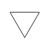
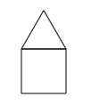

## Programmeren in JavaScript - Les 1

Dit is het eerste tutorial om te leren programmeren met JavaScript. 

Met de knoppen onder dit venster kun je een andere les selecteren.

---

### Boek

Naast deze tutorials is er een uitleg via het [boek](http://infvo.com/books/pjs-0/), hoofdstuk "[Elementaire opdrachten en opeenvolging](http://infvo.com/books/pjs-0/Chapter%202/README.html)".

---

### JSBin tips

Enkele tips voor het werken met JSBin:

* Je kunt een deelvenster openen of sluiten door op de bijbehorende tab (bovenaan) te klikken;
* Sluit JSBin-deelvensters die je niet gebruikt;
* Als er niets gebeurt, controleer dan of "Auto-run JS" geselecteerd is (in het output-venster, bovenin of onderin).

---

Ga nu naar de volgende pagina door op het pijltje rechtsboven dit tutorial-deel te klikken.


## Bestuur de Turtle
Als eerste stap naar het programmeren gebruiken we een "tekenrobot". Stel je dit voor als een robot-schildpad (*turtle*) met een pen. Deze turtle kent de volgende opdrachten:

* `forward(n)` - ga *n* stappen vooruit;
* `right(n)` - draai *n* graden naar rechts;
* `turnRight(r, n)` - maak een bocht met straal *r* over *n* graden;
* `penUp()` - haal de pen van het tekenvel;
* `penDown()` - zet de pen op het tekenvel.

360 graden is een hele draai; 90 graden is een kwartslag naar rechts; -90 graden is een kwartslag naar links.

Je bestuurt de turtle met de knoppen in het blauwe deelvenster. Later leer je de turtle te *programmeren*.

De knop *Clear canvas & log* maakt  het scherm schoon en zet de turtle in de beginpositie. 

---

*Opdrachten:*

1. Teken met deze knoppen een vierkant. <br> *Hint:* klik een aantal malen op knop *testA();*
2. Je kunt de waarden in de witte invoer-vakjes veranderen. Teken nu een groter vierkant met `forward` en `right`.


## Log van acties

In het venster naast (of onder) het teken-canvas zie je de *log* van de acties die uitgevoerd zijn voor de tekening die je ziet. Deze reeks van acties vormen het *proces* waarvan de tekening het *resultaat* is.

De knop voor het schoonvegen van het Canvas maakt ook deze log weer leeg.

Probeer steeds te begrijpen hoe de opdrachten die je geeft, het proces dat daaruit volgt, en de resulterende tekening samenhangen.


## De toestand van de turtle

De turtle staat altijd op een bepaalde plaats op het tekenvel (het *Canvas*), in een bepaalde richting.

De *plaats* geven we aan door de x-positie (horizontaal, neemt toe naar rechts) en de y-positie (verticaal, neemt toe naar beneden). <br> (0,0) is de linkerbovenhoek.

De *richting* (`dir`) geven we aan als hoek met de x-richting (x-as), waarbij een draaiing  naar rechts een positieve hoek is.

De *pen* kan op het tekenvel staan (`down: true`), of omhoog (`down: false`).

De plaats, de richting, en de pen-positie vormen samen de *toestand* of *state* van de turtle. Deze zie je in het gele vlak.

---

1. Kijk hoe de toestand verandert door de opdrachten die je met de knoppen geeft.
2. Probeer de toestand te bereiken: `x: 150, y: 150, down: true`. Kun je deze toestand bereiken zonder een spoor achter te laten?
3. Wat gebeurt er als je een negatief getal invoert als parameter voor `right`?
4. Wat gebeurt er als je een negatief getal invoert als parameter voor `forward`?


## JSBin

De vensters rechts naast dit tutorial zijn de JSBin-vensters. Je kunt een deelvenster openen of sluiten door op de bijbehorende tab (bovenaan) te klikken.

Voor de opdrachten hoef je niet te begrijpen hoe het HTML-deel werkt, en hoe de JavaScript opdrachten voor de turtle gemaakt zijn. Maar als je nieuwsgierig bent, kun je overal bij.

---

*Opdrachten:*

1. Open het HTML-venster. Scroll naar het onderste deel van het venster, en probeer daar de beschrijving van de *User-defined commands* te vinden. Vind je de verschillende onderdelen terug in het Output-venster?
2. Open het JavaScript-venster. Scroll naar het onderste deel van het venster, waar de *User defined functions* staan. De functies `testA`, `testB` en `testC` zijn gekoppeld aan de knoppen (buttons) met dezelfde naam in het "user defined commands" deel van de Output. Probeer deze knoppen uit.
3. Sluit het HTML-venster en het JavaScript-venster, en open het Console-venster. Dit gebruik je in de volgende opdracht.


## Console

Op het console kun je JavaScript opdrachten invoeren die direct uitgevoerd worden. Dit kun je ook gebruiken voor de turtle. Voorbeeld:<br>`forward(30);`<br> *Sluit elke opdracht op het console af met de return-toets.*

Let goed op de notatie: je moet precies de goede naam gebruiken, de juiste haakjes en de juiste leestekens, zoals de puntkomma.

Als je een fout maakt in de notatie, krijg je soms een foutmelding, en soms gebeurt er heel iets anders dan je bedoelt.

Door bijv. `pos.x` of `down` in te voeren kun je de toestand van de turtle opvragen.

---

*Opdrachten:*

1. Gebruik het console als rekenmachine. Voer bijvoorbeeld in: `6 * 7`
2. Vraag de toestand van de turtle op via het console.


## Functies: aanroep

Door middel van een programma kun je de turtle opdrachten uit laten voeren zonder deze steeds zelf in te voeren: je *automatiseert* zo de turtle.

Een *functie* is een stukje programma dat we een naam geven.

Het gebruik ofwel de *aanroep van een functie* hebben we eerder gezien. Deze heeft de vorm:

```
functienaam(...parameters...)
```

Enkele voorbeelden:

```js
penDown();
forward(50);
turnRight(50, 90);
```

We kunnen een functie ook koppelen aan een knop (button); een *click*  op die button zorgt dan voor een aanroep van die functie. 
      
---

*Opdrachten:*

1. Roep de functie `testA` van de bijbehorende knop aan vanuit het console: `testA();`
2. Teken een vierkant door opdrachten op het console. *Tip:* je kunt ook (een deel van) de log kopiëren naar het console.
3. wat gebeurt er als je op het console `penUp` invoert, dus zonder de `()`? <br> Of `forward`?


## Functies: definitie

We gaan nu zelf een functie definiëren. We groeperen een reeks opdrachten met behulp van accolades, en geven deze groep een naam, bijv.:

```js
function sqEdge50() {
  forward(50);
  right(90);
}
```

De groep opdrachten tussen de accolades `{...}` noemen we de *body* van de functie.

Een aanroep van deze functie heeft de vorm: `sqEdge50();`

---

*Opdrachten:*

1. Open het JavaScript-venster, en zoek onderaan naar de "user defined functions". Kopieer daar de functie-defintie van `sqEdge50`.
2. Test deze functie door deze vanuit het console aan te roepen.
3. Zoek de functie `testB` in het JavaScript-venster. Verander de body tussen `{...}` zo dat deze de functie `sqEdge50` aanroept. Test of de button `testB();` nu doet wat je verwacht.
4. Maak een figuur door een aantal malen op de button `testB();` te klikken.


## Voorbeeld: rechthoek

We kunnen de functie die we zojuist gedefinieerd hebben, gebruiken als stap voor het tekenen van een rechthoek:

```js
function square50() {
  sqEdge50();
  sqEdge50();
  sqEdge50();
  sqEdge50();  
}
```

---

*Opdrachten*:

1. Voeg de functie-definitie van `square50` toe aan de *user-defined functions* in het JavaScript-venster, na de definitie van `sqEdge50`. 
2. Zoek de functie `testC`. Verander de body tussen `{...}` zo dat deze de functie `square50` aanroept. Test of de button `testC();` nu doet wat je verwacht.
3. Breid de body van `testC` uit zodat deze na het tekenen van het vierkant, de turtle 15 graden naar rechts laat draaien. Test dit met de button.
4. Maak een figuur door een aantal malen op de button `testC();` te klikken.

## Voorbeeld: driehoek

Een volgende opdracht is om een driehoek te tekenen - op dezelfde manier als het vierkant.

> 

Zorg ervoor dat de turtle na het tekenen van de driehoek weer precies in dezelfde positie staat.

We voeren deze opdracht uit in twee stappen:

1. Maak een functie voor de het tekenen van een zijde van een driehoek.
2. Maak een functie voor het tekenen van een driehoek: herhaald tekenen van een zijde.

---

*Opdrachten*:

1. Definieer de functie `triEdge50`, voor het tekenen van de zijde een driehoek.
2. Test deze functie door deze aan te roepen vanuit `testB`. Druk de button `testB` herhaald in.
3. Definieer de functie `triangle50`, voor het tekenen van een driehoek.
4. Test deze functie door deze aan te roepen vanuit `testC`. Controleer of de turtle weer in dezelfde positie terugkomt.

## Uitwerking: driehoek

Een mogelijke uitwerking voor de driehoek is:

```js
function triEdge50() {
  forward(50);
  right(120);
}

function triangle50() {
  triEdge50();
  triEdge50();
  triEdge50();
}
```

---

*Opdracht(en):*

1. probeer op eenzelfde manier een 5-hoek te maken.
2. hoe ziet het algemene patroon voor een n-hoek eruit? (Later zullen we daarvoor een functie maken.)

## Opdracht: huisje

Een eenvoudig huisje ziet er als volgt uit:

> 

---

*Opdrachten*

1. Zorg ervoor dat de button `testB` een driehoek tekent, en `testC` een vierkant.
1. Teken een huisje door eerst een driehoek te tekenen, en dan een vierkant (met deze buttons). <br> Gaat dit goed?
2. Als je eerste poging geen huisje oplevert, probeer dan uit te vinden welke extra opdrachten je nodig hebt om met je driehoek- en vierkant-functies een huisje te tekenen.
3. Definieer een functie voor het tekenen van een huisje. Test deze met behulp van `testA`.

## Tweehoek

We hebben de voorbeelden van het vierkant en van de driehoek gezien. Hoe zou een "regelmatige tweehoek" er dan uit kunnen zien?

* een regelmatige tweehoek heeft twee zijden van gelijke lengte;
* een tweehoek is een gesloten figuur: begin en eindpunt sluiten op elkaar aan;
* na het tekenen van de tweehoek moet de turtle weer op precies dezelfde plek staan, in dezelfde richting;
* een regelatige tweehoek bestaat uit twee identieke opdrachten van de vorm `forward(size); right(angle)`. 
    * welke waarde zou `angle` dan moeten hebben?
    * voor het vierkant geldt: `4 * angle === 360`; voor de driehoek geldt: `3 * angle === 360`; dan ligt voor de tweehoek voor de hand: `2 * angle === 360`, met andere woorden: `angle === 180`.

---

*Opdrachten*

1. Maak een functie `biangle(sz)`, voor het tekenen van een tweehoek met zijde `sz`. Test deze functie met `testA`.
2. Breid `testA` uit met een draaiing van de turtle over (bijvoorbeeld) 15 graden. Welke figuur krijg je nu door herhaald klikken?

## Tips

* je kunt de vorige opdracht in het console oproepen door het pijltje naar boven.
* gebruik spaties en vormgeving zoals in de voorbeelden, om je programma's leesbaar te houden.
* om handig met de ruimte om te gaan, kun je in JSBin steeds de vensters sluiten die je niet gebruikt.
* als je in het JavaScript venster foute code invoert, krijg je foutmeldingen in het console-venster. Als je dat niet geopend hebt, zie je die foutmeldingen niet.